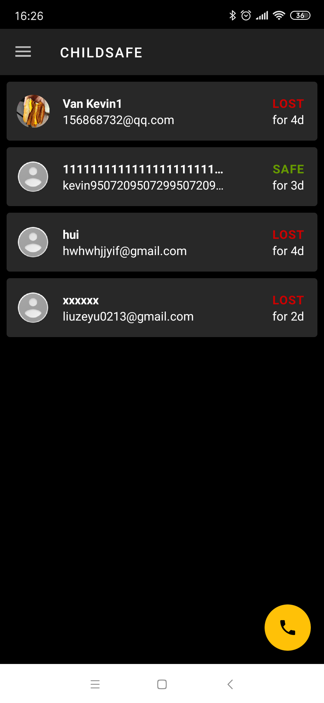

# ChildSafe App Project Overview

## **User Manual**

### **Introduction**
ChildSafe is an app for real-time location tracking of lost children while avoiding domestic abuse. When young children get lost, ChildSafe can improve the chance for their parents and the police to find them in prime time. 
This app provides parent end, child end, and police end. After registered in this app, children can bind with their parents within the app. Once the child is claimed lost (either by himself/herself or by the bound parent), the app on the child's phone will start recording GPS location and upload the data to the firebase server.
Then a police officer who use the police end can see the track of that lost child and start searching. We build this app with children's privacy in mind, no GPS data will ever be sent to the parent phone.  
The following are more detailed descriptions and instructions of specific functions.

* * *

  
Fig.1 Log-in, sign-up and reset password interface  

### **Entry** 
When opening this app, the user will first see the welcome page as the entrance. If the app is launched the first time, the app will ask the user to grant permission on GPS service and call service. Then other activities will be triggered depends on the user’s log-in status.

### **Sign Up**
On the sign-up page, the user can sign up a new account with a selected role(parents or children) by entering their email and password, then he/she will receive a verification email. Only email verified user can log into the app. The police accounts are created on the server and distributed to the police.

### **Log-in and Reset Password**
On the log-in page, the user can log in using their email and password. If the user forgets the password, he/she can click on the "Forget your password?" button on the log-in page. It enables the user to reset the password using their registered email.

  

  
Fig.2 Edit profile, change settings or read the help page  

### **Edit Profile**
When the user logs into the app, he/she can click the menu button at the top left corner, and then click "profile". He/She can then update the username and the profile photo.

### **Settings**

When the user logs into the app, he/she can click the menu button at the top left corner, and then click "settings". In here, he/she user can turn on dark mode, change languages and enable/disable notifications. 

### **Help**

When the user logs into the app, he/she can click the menu button at the top left corner, and then click "help". In here, he/she can see the help manual.

  

  
Fig.3 Main page for child, parent and police end  

### **Child Main Page**
After the child user log in, he/she can see a very simple interface. It has two floating action buttons at the bottom right corner. 
- The child can click on the red "exclamation mark" button to claim himself/herself as lost. And then the parents will receive a lost notification if they allow the send notification functions. Also, this child's basic information and GPS information will show on the police end. However, the child cannot turn himself/herself status from lost to safe. This function prevents some bad people from changing the child's status and making bad use of it.  
- The child can click on the yellow "plus sign" button to send a binding request to parents. And the child cannot see how many parents they are bound with.

The reason for a simple and uninformative child end UI is to prevent human trafficker from knowing what is going on.

### **Parent Main Page**

After parent user log in, he/she can see all the bound children information and status on a grid. And the following are four other main functions on the parent end.
- When a child sends a bind request to the parent user, the parent user can choose to accept or decline.
- The parent can change bound children’s status by long press the child's name card and then click the confirm button. Once the parent changes a child's status to lost, the app will call 911 automatically.
- The parent can unbind children by swipe left on the child's name card. 
- The parent can click on the bottom right corner "phone" button to make a call to 911 manually.

### **Police Main Page**
After police user log in, he/she can see all the lost children on this page. If he/she clicks on one of the children, he will be brought to the GoogleMap page which displays the past track of the lost child. It can also animate the whole track history using time information. 

  
Fig.4 Google map display lost child's track, app navigation drawer and unlink a child step. 

 

  
Fig.5 App behavior under different settings (dark mode, chinese language) 

***

## **Support Manual**
### **Introduction**
This file is a support manual for developers of the ChildSafe App. ChildSafe is an app for real-time location tracking of lost children while putting children's privacy at the highest priority and avoiding domestic abuse. 
### **installation and configuration**

1.	Download the project using:
git clone https://gitlab.oit.duke.edu/wf39/childsafe.git
2.	Open the project with the latest Android Studio.
3.	Build the project and run with an appropriate emulator. (Android version SDK 26+). A pixel 2 phone with Android 9.0 (SDK 28) is recommended.

### **Overall structure of code**
#### Front-end

 
Fig.6 Relation between different activities  

- **BaseActivity:** The base activity that other activities extend. This activity is in charge of handle app settings, prepare the server and check permissions. 

- **OnBootReceiver:** A receiver class that listens to phone reboot signal and invokes child status monitor in the background.

- **EntryActivity:** The entrance of the app, shows the welcome page, create notification, ask the user to grant permission if app is launched the first time or start other activities depends on the user’s log in status.

- **LoginActivity:** Allow the user to log in using email and password.

- **SignUpActivity:** Allow the user to sign up a new account with the selected role and also send verification emails.

- **ResetPasswordActivity:** Let the user reset the password using their registered email. 

- **MainBaseActivity:** The activity for the main user interface. It listens to the user’s data on the server and connects various fragments. 

- **MainChildActivity/MainParentActivity/MainPoliceActivity:** Extends MainBaseActivity. Will inflate the corresponding fragment when started.

 
Fig.7 Relation between different fragments  

- **MainBaseFragment:** The base fragment that is extended by other fragments. It prepares the server and receives the current user from the activity that launches it. 

- **EditProfileFragment:** Allow users to edit their names and add a photo. 

- **SettingsFragment:** Allow users to turn on dark mode, change the language and enable/disable notifications. 

- **HelpFragment:** Displays the help manual.

- **ChildMainFragment:** Allow the child to bind with parents and claim self as lost.

- **ChildGridFragment:** Display all the bound child information on a grid. Parents can change their children’s status or unbind them. Parents can also call 911 on this page.

- **LostChildFragment:** Police can see all the lost children on this page. If he clicks on one of the children, he will be brought to the GoogleMapFragment. 

- **GoogleMapFragment:** Displays the past track of the lost child. It can also animate the whole track history using time information. 

- **ChildInfoRecyclerViewAdapter/LostChildInfoRecyclerViewAdapter/CardSwipeController:** UI classes that is used to manipulate the recyclerview which displays the children’s information. 

 
Fig.8 Models in the Model-View-Controller (MVC) pattern  

- **NetWorkUtil/SettingsUtil/UIUtil:** Utility classes that are used by other classes to get network status, settings and UI components. 

- **AddEmailSnackbar/RoundedImageView/SmartTextView:** customized UI component classes.

- **ChildStatusMonitorWorker:** Monitor child status in the background and upload location data to the server when the child is lost.

- **ParentNotifyWorker:** Notify the parent when one of his/her children is lost.

- **User:** the user class (data class).

- **ServerAdapter:** Server class that communicates with the firebase server. 

#### key APIs into the back-end

- createAccount

- signInWithEmailAndPassword

- sendEmailVerification

- sendPasswordResetEmail

- signOut

***

- getCurrentUser

- getUserById

- getUserByEmail

***

- uploadImage

- updateUserInfo

- updateChildStatus

- updateBindingStatus

- removeBinding

***

- addGPSLocation

- clearGPSLocation

- getTimeStampedGPSData

***

- getLostChildrenList

***

Those methods are pretty self-explanatory. Notice they all extend the Google Task API which is an async task class that also allows task result retrieval. 

### **Additional Files**

- **project_resources/Project Plan.xlsx:**  the document presents all taskes (from sponsor's functional and non-functional requirements) of the ChildSafe app;
- **project_resources/Architecture/:** the documents for the system architecture design
- **project_resources/Child Safe Test Plan.pdf:** the document contains detailed information of testing methodology, personnel testing and schedule.
- **project_resources/ChildSafe_pre.pptx:** the slides that we used for the final project presentation

